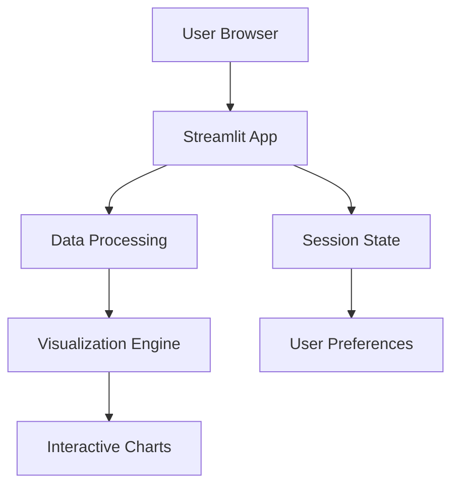

# python library 
# WHAT IS NUMPY ? 
NumPy (Numerical Python) is a Python library for fast mathematical and scientific computing.
It provides a special data structure called ndarray (N-dimensional array), which is faster and more efficient than normal Python lists for handling numbers.
```
pip install numpy
```
ex: import numpy as np

arr = np.array([1, 2, 3, 4])  
print(arr * 5)


| Category                        | Key Functions / Methods                                                             | What It Does                                                       |
| ------------------------------- | ----------------------------------------------------------------------------------- | ------------------------------------------------------------------ |
| **Array Creation**              | `np.array()`, `np.zeros()`, `np.ones()`, `np.arange()`, `np.linspace()`, `np.eye()` | Create arrays in different ways (empty, sequence, identity matrix) |
| **Random / Probabilities**      | `np.random.rand()`, `np.random.randint()`, `np.random.randn()`                      | Generate random numbers, useful for testing and simulations        |
| **Array Operations**            | `+`, `-`, `*`, `/`, `**`                                                            | Element-wise arithmetic operations                                 |
| **Aggregations / Statistics**   | `sum()`, `mean()`, `max()`, `min()`, `std()`, `var()`                               | Compute totals, averages, standard deviation, variance, etc.       |
| **Indexing / Slicing**          | `arr[0]`, `arr[0:3]`, `arr[arr>5]`, `arr[[0,2]]`                                    | Access elements, slices, boolean and fancy indexing                |
| **Reshape / Transform**         | `reshape()`, `ravel()`, `flatten()`, `transpose()`, `resize()`                      | Change the shape or orientation of arrays                          |
| **Linear Algebra**              | `np.dot()`, `np.cross()`, `np.linalg.inv()`, `np.linalg.det()`                      | Matrix multiplication, inverse, determinant, cross products        |
| **Math Functions**              | `np.sin()`, `np.cos()`, `np.exp()`, `np.log()`                                      | Apply mathematical operations element-wise                         |
| **Array Combining / Splitting** | `np.concatenate()`, `np.vstack()`, `np.hstack()`, `np.split()`                      | Merge or split arrays vertically or horizontally                   |
| **Sorting / Uniques**           | `np.sort()`, `np.argsort()`, `np.unique()`                                          | Sort arrays, get sorted indices, or unique elements                |


# WHAT IS PANDAS ?

Pandas is a Python library used for working with data in table format (rows and columns).
It helps you load, clean, filter, analyze, and transform data easily.
```
pip install pandas
```

| Category                   | Key Functions / Methods                                      | What It Does                                          |
| -------------------------- | ------------------------------------------------------------ | ----------------------------------------------------- |
| **Data Structures**        | `Series`, `DataFrame`                                        | Series = single column, DataFrame = full table        |
| **File Handling**          | `read_csv()`, `read_excel()`, `to_csv()`, `to_excel()`       | Read/write data from/to files                         |
| **Data Cleaning**          | `dropna()`, `fillna()`, `replace()`, `astype()`, `rename()`  | Handle missing data, change types, rename columns     |
| **Filtering / Selection**  | `loc[]`, `iloc[]`, boolean filters                           | Select rows/columns by label, position, or condition  |
| **Joining / Merging**      | `merge()`, `join()`, `concat()`                              | Combine multiple DataFrames like SQL JOINs            |
| **Grouping / Aggregation** | `groupby()`, `sum()`, `count()`, `mean()`, `max()`, `min()`  | Aggregate data by categories                          |
| **Transformations**        | `apply()`, `map()`, `applymap()`                             | Apply functions to rows, columns, or entire DataFrame |
| **Sorting / Ranking**      | `sort_values()`, `sort_index()`, `rank()`                    | Sort data by values or indices                        |
| **Pivot / Reshape**        | `pivot()`, `pivot_table()`, `stack()`, `unstack()`, `melt()` | Reshape data tables for analysis                      |
| **Datetime Operations**    | `to_datetime()`, `dt.year`, `dt.month`, `dt.day`             | Work with dates and times                             |
| **Unique / Count**         | `unique()`, `nunique()`, `value_counts()`                    | Count or list unique values in a column               |


# WHAT IS FLASK ?

Flask is a lightweight micro web framework for Python that allows you to build web applications and APIs quickly and with minimal code. It's known for its simplicity and flexibility.  
Typical Use Cases:   

REST APIs   

Microservics   

Small to medium web applications   

Prototyping   

Educational projects
Backend for single-page applications


# WHAT IS STREAMLIT ?
A Streamlit web application for interactive data visualization and analysis.

## 🚀 Live Demo
[](https://your-app-name.streamlit.app/)

## 📋 Features
- 📈 Interactive data visualizations with Plotly
- 📁 CSV/Excel file upload support
- 🔍 Real-time data filtering
- 📊 Multiple chart types (Bar, Line, Scatter, Histogram)
- 📱 Responsive design for mobile devices
- 🌙 Dark/Light theme toggle

## 🏗️ Architecture


# this is streamlit code of student form 
```
import streamlit as st 
    st.set_page_config(page_title="Student Form", layout="centered")

st.title("Student Registration Form")

# ---- FORM ----   
with st.form("student_form"):
    name = st.text_input("Student Name")
    email = st.text_input("Email")
    age = st.number_input("Age", min_value=1, max_value=100)
    gender = st.selectbox("Gender", ["Male", "Female", "Other"])
    course = st.selectbox(
        "Course",
        ["BCA", "BSC", "BCOM", "BA", "BTech"]
    )
    skills = st.multiselect(
        "Skills",
        ["Python", "Java", "AWS", "Docker", "Linux"]
    ) ```

    submit = st.form_submit_button("Submit")

```
```
streamlit run student_form.py
```


# 🎨 Matplotlib: Python's Premier Visualization Library

<div align="center">
  


*The foundational plotting library for scientific visualization in Python*

</div>

## 📋 Table of Contents
- [Introduction](#introduction)
- [Installation](#installation)
- [Quick Start](#quick-start)
- [Plot Types](#plot-types)
- [Examples](#examples)
- [Best Practices](#best-practices)
- [Resources](#resources)

## 🎯 Introduction

**Matplotlib** is a comprehensive 2D plotting library for Python that provides:
- Publication-quality figures in various formats (PNG, PDF, SVG, JPG)
- A MATLAB-like interface for easy plotting
- Object-oriented API for advanced customization
- Support for LaTeX expressions in text

### 🚀 Key Features
- ✅ **Low-level control** over every plot element
- ✅ **Interactive plots** in Jupyter notebooks
- ✅ **3D plotting** capabilities
- ✅ **Animation support**
- ✅ **Seamless integration** with NumPy and Pandas

## ⚡ Installation

### Method 1: Using pip
```bash
pip install matplotlib


